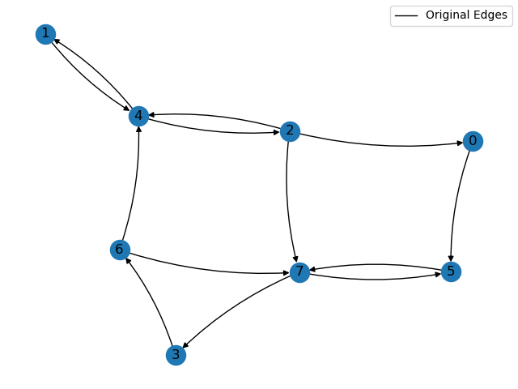
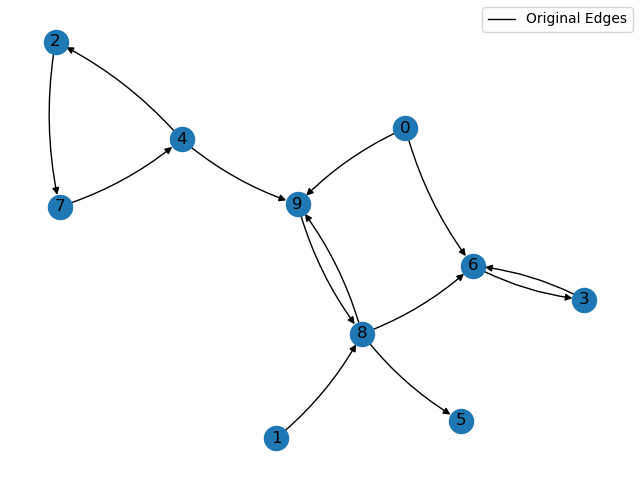
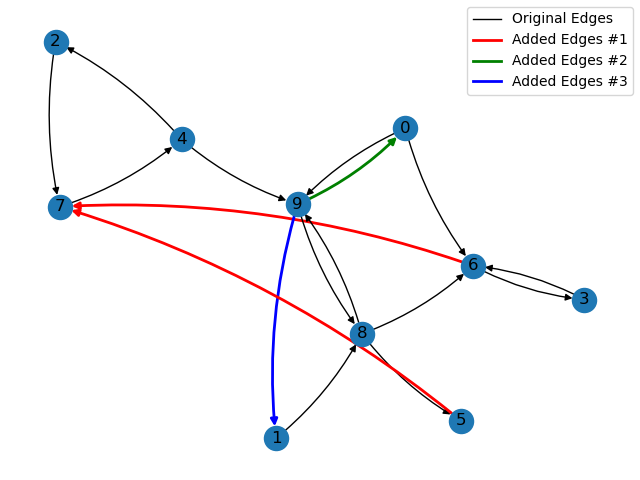

# dist-strong-connectivity

Finite-Time Distributed Algorithms for Verifying and Ensuring Strong Connectivity in Directed Networks

This repository stores the implementation of the proposed approaches in the following academic paper:

```text
@inproceedings{atman2021cdc,
  title = {Distributed Algorithms for Verifying and Ensuring Strong Connectivity in Directed Networks},
  booktitle = {2021 60th IEEE Conference on Decision and Control (CDC)},
  author = {Atman, Made Widhi Surya and Gusrialdi, Azwirman},
  year = {2021},
  note = {To be presented}
}
```

_*An extended version for journal submission is under preparation._

## Files and Usage

``` text
strong_connectedness_test.py --> main script
testGraphs.py --> several adjacency matrices for testing
msgForwarder.py --> simulate sending message over nodes and visualize graph
nodeconnCDC.py --> algorithms in CDC paper
```

### ```strong_connectedness_test.py```

Main script to execute.

To switch between algorithms in the paper, comment/uncomment between line 41-43 in.

```python
# outMessage = Node[i].updateVerifyStrongConn(inMessage) # Algorithm 1
# outMessage = Node[i].updateEstimateSCC(inMessage) # Algorithm 2
outMessage = Node[i].updateEnsureStrongConn(inMessage) # Algorithm 3
```

### ```nodeconnCDC.py```

Implementation of the algorithms as a ```NodeConn``` class.
1. _Algorithm 1: Distributed verification of a directed graph's strong connectivity._  
   Each node returning their estimation (via terminal output) whether the graph representation of their network communication is strongly connected or not.
2. _Algorithm 2: Distributed Estimation of Strongly Connected Component._
   Each node estimating their own strongly connected components (SCC), and determine whether their SCC is a sink-scc, source-scc, or the whole graph (the graph is originally a strongly connected graph).
3. _Algorithm 3: Distributed Link Addition Algorithm to Strongly Connect A Weakly Connected Graph._  
   Each node distributively run Algorithm 2, then a representative node in each sink-scc propose a new link toward a source-scc.
   The procedure is repeated until the graph is strongly connected.  
   _Note: running the algorithm with disconnected graph results in abnormal exit (never meet ending condition)._

### ```msgForwarder.py```

Implementation of the message passing between one node to another using the ```msgForwarder``` object. This class is also used to visualize the link addition procedure. The message is a dictionary constructed in ```NodeConn``` object consisting of: ```sender```, ```dest```, ```msgType```, and ```msg```.

### ```testGraphs.py```

List of graphs used during the testing. These graphs are identical to the examples in the paper (with vertex number starting from 0 instead of 1).

#### _Graph 1: Strongly Connected Graph with 8 nodes_



#### _Graph 2: Weakly Connected Graph with 10 nodes_



## Expected Results

An example of the expected result with Graph 2 in the ```testGraphs.py```.

#### _Algorithm 1: Distributed verification of a directed graph's strong connectivity_
Each node estimation output is displayed through the terminal.

```
Node 0 finished Algorithm 1 in iterations 20
Node 0: The communication graph is NOT strongly connected
Node 1 finished Algorithm 1 in iterations 20
Node 1: The communication graph is NOT strongly connected
... 
...
Node 9 finished Algorithm 1 in iterations 20
Node 9: The communication graph is NOT strongly connected
Centralized counter: All nodes finished in iterations 20
```

#### _Algorithm 2: Distributed Estimation of Strongly Connected Component._
Each node estimation output is displayed through the terminal.

```
Node 0 finished Algorithm 2 in iterations 30 
Node 0: own SCC [0] - Source-SCC
Node 1 finished Algorithm 2 in iterations 30 
Node 1: own SCC [1] - Source-SCC
Node 2 finished Algorithm 2 in iterations 30
Node 2: own SCC [2 4 7] - Source-SCC
Node 3 finished Algorithm 2 in iterations 30
Node 3: own SCC [3 6] - Sink-SCC
...
...
Node 9 finished Algorithm 2 in iterations 30
Node 9: own SCC [8 9]
Centralized counter: All nodes finished in iterations 30
```

#### _Algorithm 3: Distributed Link Addition Algorithm to Strongly Connect A Weakly Connected Graph._
The procedures of estimations is displayed in the terminals.
The added links and the resulting graph is displayed as a figure (below).



## Contributors

The algorithms in this repository are developed by Made Widhi Surya Atman and Azwirman Gusrialdi from Intelligent Networked Systems (IINES) Group,
Faculty of Engineerings and Natural Sciences, Tampere University.

## Acknowledgements

This result is part of a project that has received funding from the Academy of Finland under Academy Project decision number 330073 - Resilient distributed optimization for cyber-physical systems.
